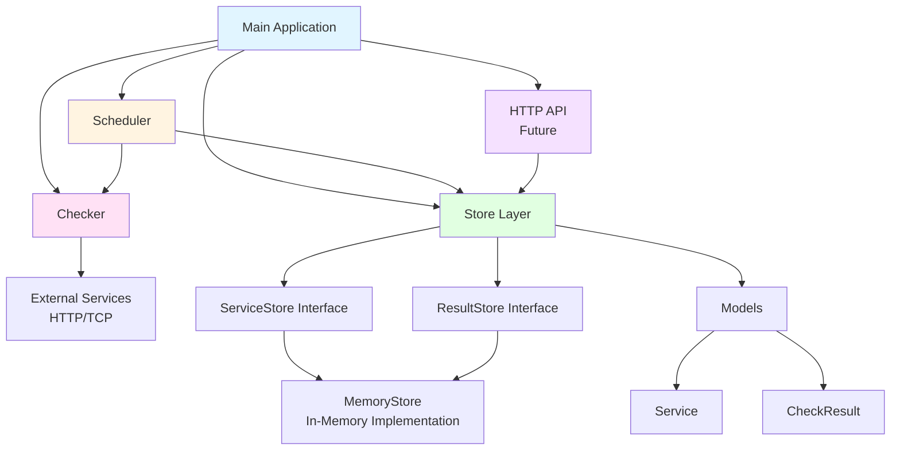

# Env-watch

## Overview

EnvWatch is a service monitoring tool that continuously pings important services (HTTP endpoints, TCP ports, and Kubernetes services), measures uptime and latency, keeps history in a database, and exposes an API to view current status and SLO compliance.

## Architecture

### Overview

EnvWatch follows a clean, modular architecture with clear separation of concerns. The system is built using Go interfaces, allowing for easy testing and future extensibility (e.g., swapping in-memory storage for a database).

### Architecture Diagram



### Component Responsibilities

#### 1. **Main Application** (`cmd/envwatch/main.go`)
- **Role**: Application entry point and dependency injection
- **Responsibilities**:
  - Initializes all components (Store, Scheduler, Checker)
  - Wires dependencies together
  - Starts the scheduler in a background goroutine
  - Manages application lifecycle

#### 2. **Scheduler** (`internal/scheduler/`)
- **Role**: Orchestrates periodic health checks
- **Responsibilities**:
  - Runs on a configurable tick interval (e.g., every 10 seconds)
  - Fetches all registered services from the store
  - Spawns concurrent goroutines to check each service
  - Saves check results back to the store
  - Handles graceful shutdown via context cancellation

#### 3. **Checker** (`internal/checker/`)
- **Role**: Performs actual health checks against services
- **Responsibilities**:
  - Implements `Checker` interface for testability
  - Supports HTTP and TCP health checks
  - Measures latency (time from request start to response)
  - Returns `CheckResult` with success status, latency, and error messages
  - Handles timeouts and connection errors

#### 4. **Store Layer** (`internal/store/`)
- **Role**: Data persistence abstraction
- **Components**:
  - **Interfaces** (`store.go`):
    - `ServiceStore`: Manages service registration (Create, Get, List)
    - `ResultStore`: Manages check result history (Save, GetRecent)
  - **Implementation** (`memory.go`):
    - `MemoryStore`: In-memory implementation using Go maps
    - Thread-safe using `sync.RWMutex`
    - Auto-generates unique IDs for services and results
- **Design Pattern**: Interface-based design allows swapping implementations (e.g., SQLite, PostgreSQL) without changing other code

#### 5. **Models** (`internal/model/`)
- **Role**: Data structures representing domain entities
- **Components**:
  - `Service`: Represents a monitored service (ID, name, type, target URL, check interval)
  - `CheckResult`: Represents a health check outcome (service ID, timestamp, success, latency, error message)

#### 6. **HTTP API** (`internal/api/`) - *Future*
- **Role**: REST API for external access
- **Planned Responsibilities**:
  - Expose service management endpoints
  - Provide check result history
  - Calculate and return SLO metrics

### Data Flow

1. **Service Registration**:
   ```
   Main → Store.CreateService() → Service stored with auto-generated ID
   ```

2. **Periodic Health Check Cycle**:
   ```
   Scheduler (every N seconds)
     ↓
   Store.ListServices() → Get all registered services
     ↓
   For each service (concurrent goroutines):
     ↓
   Checker.Check() → Ping service (HTTP/TCP)
     ↓
   Measure latency, check success/failure
     ↓
   Store.SaveResult() → Save CheckResult
   ```

3. **Query Results** (via future API):
   ```
   API → Store.GetRecentResults() → Return check history
   ```

### Key Design Decisions

- **Interfaces over Concrete Types**: All major components use interfaces, enabling easy testing and future extensibility
- **Concurrent Checks**: Each service check runs in its own goroutine for parallel execution
- **Context-Based Cancellation**: All operations respect context for graceful shutdown
- **Thread-Safe Storage**: MemoryStore uses `RWMutex` to safely handle concurrent reads/writes
- **Pointer Receivers**: Methods that modify state use pointer receivers for efficiency

## What EnvWatch Does

### Service Registration

You register services to monitor, for example:

- **API Gateway**: `https://api.example.com/health`
- **Payments Service**: `http://payments.namespace.svc.cluster.local:8080/health`
- **Redis**: `redis.namespace.svc.cluster.local:6379` (TCP)

### Monitoring Process

EnvWatch performs the following operations:

1. **Periodic Checks**: Runs health checks every N seconds
2. **Metrics Collection**: Measures:
   - Status (up/down)
   - Latency (in milliseconds)
3. **Data Storage**: Stores check results in SQLite database
4. **SLO Computation**: Calculates service level objectives, such as:
   - 99.9% availability over the last 7 days
   - P95 latency over the last 1 hour

## API Endpoints

EnvWatch exposes an HTTP API (and optionally a simple HTML page) with the following endpoints:

### Service Management

- `GET /services` - List all services and their current status
- `POST /services` - Register a new service to monitor

### Service Details

- `GET /services/{id}/history` - Get last X check results for a service
- `GET /services/{id}/slo` - Get computed SLOs for a service
- `POST /services/{id}/check` - Trigger an on-demand check for a service

## Deployment

EnvWatch is designed to run inside Kubernetes:

- **Deployment**: Runs as a Kubernetes Deployment
- **Service**: Exposes a Kubernetes Service
- **Health Probes**: Configured with liveness and readiness probes
- **Monitoring Scope**: Monitors other services in the same cluster or external URLs
